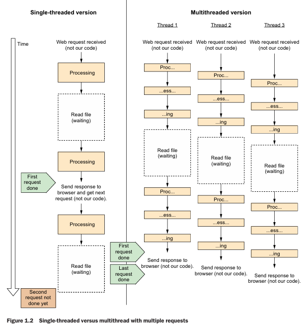
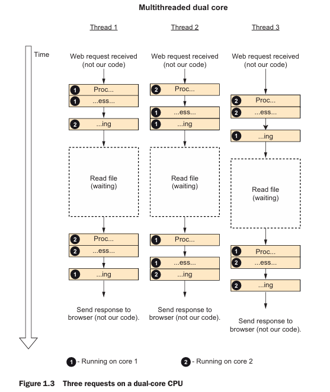
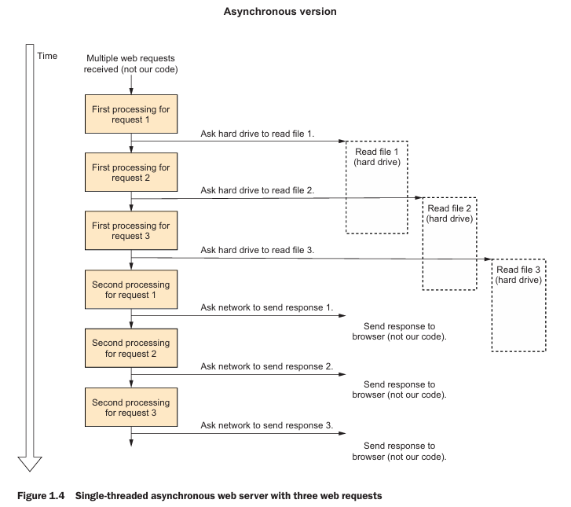
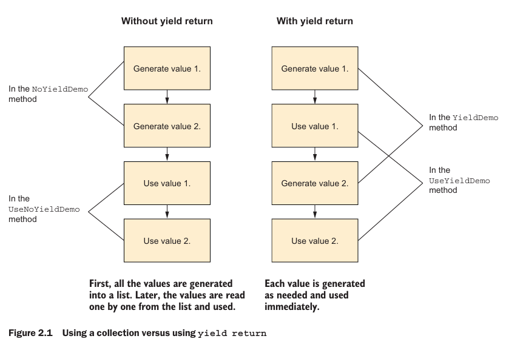

# 🚀 Concurrency in C#

> **Doing more than one thing at a time.**  
> 💡 You need concurrency any time you need an application to do one thing while it’s working on something else.

---

## 🔀 Types of Concurrency

### 👑 Multithreading
Refers to literally using multiple threads.

### 🎇 Parallel Processing
> Doing lots of work by dividing it up among multiple threads that run concurrently.

### 🧠 Asynchronous Programming
It is centered around the idea of an asynchronous operation: some operation that is started that will complete some time later. While the operation is in progress, it doesn’t block the original thread; the thread that starts the operation is free to do other work.

> ✅ When the operation completes, its future or invokes its callback or event to let the application know the operation is finished.

---

## ⚡ Asynchronous Programming

### 💎 Benefits : 
- **🖱Responsiveness** : An asynchronous program can remain responsive to userinput while it’s working.
- **📈Scalability** : A server application can scale somewhat just by using the thread pool, but an asynchronous server application can usually scale an order of magnitude better than that.

> **Asynchronous programming** frees up a thread. For server applications, asynchronous programming frees up request threads; this permits the server to use its threads to serve more requests.

### 🔑 Key Concepts

Modern asynchronous .NET applications use two keywords: 
`async`and `await`. The `async` keyword is added to a method declaration, and performs
a double purpose: it enables the `await` keyword within that method and it signals the compiler to generate a state machine for that method, similar to how `yield return` works. An `async` method may return `Task<TResult>`if it returns a value, `Task` if it doesn’t return a value, or any other “task like” type, such as `ValueTask`.

---

## 🔄 Multithreading vs Single Threading



In **multithreading**, we use multiple threads to do more work — just like multiple cooks making pizzas 🍕.

---

## 🧬 How Asynchronous Programming Works

> Whenever the CPU needs to do something that happens outside the CPU itself (for example, reading a file), it sends the job to the component that handles it (the disk controller) and asks this component to notify the CPU when it’s done. The asynchronous (also called nonblocking) version of the file function just queues the operation with the operating system (that will then queue it with the disk controller) and returns immediately, letting the same thread do other stuff instead of waiting (figure 1.4). Later, we can check whether the operation has been completed and access the resulting data.




> When starting the asynchronous operation, to ask the operating system to notify our program by calling a callback function we registered when starting the asynchronous operation. That callback function will need to run on a new thread (actually, a thread pool), because the original calling thread is not waiting and is currently doing something else. That’s why asynchronous programming and multithreading work well together. 

**Switching between threads is called _context switching_**.

---

### Yield return


For `yield return`, the compiler divides your code into chunks and wraps them in a class that runs the correct chunk at the correct time to simulate a function that can be suspended and resumed.

### 📃 Tasks

A Task does multiple things: it represents an ongoing asynchronous operation, lets us schedule code to run when an asynchronous operation ends, and lets us create and compose asynchronous operations.
A Task represents an event that may happen in the future, while Task<T> represents a value that may be available in the future. A `Task` just lets you know when that background operation finishes running (the Task object represents the event of the background operation ending), and `Task<T>` adds the ability to get the result of the background operation (`Task<T>` represents the value produced by the background operation). A `Task` is not a thread or a background operation, but it is sometimes used to convey the results of a background operation. 

> When we call `Task.Delay(1000)`, we get an object that represents an event that will happen in 1 second but has no corresponding thread or activity. In the same way, if we call `File.ReadAllBytesAsync`, and, for example, there is no thread reading in the background, the system asks the disk controller (a different hardware device than he CPU) to load data and calls us when it’s done, so we get back a `Task<byte[]>` object that represents the data that will be received from the disk in the future.

So a Task or Task<T> object represents an event or a value that may be available in the future. When we want to know whether this event happened or the value is available yet, there are two asynchronous approaches supported by `Task` and `Task<T>` to use a travel metaphor, there are the “Are we there yet” model and the “Wake me up when we arrive” model. 

### ⏳ Are we there yet 

The *“Are we there yet”* model, you are responsible for asking the `Task` whether it has completed yet, usually in a loop that does other things between those checks (this is called polling), which is done by reading the `IsCompleted` property. Note that `IsCompleted` is true even if the task has errored out or was canceled. 

```c#
var readCompleted = File.ReadAllBytesAsync("example.bin");
while(!readCompleted.IsCompleted)
{
UpdateCounter();
}
var bytes = readCompleted.Result;
// do something with bytes
```

> Most of the time, we don’t have anything useful to do while waiting for IsCompleted to become true, so this model is rarely used.

### Wake me up when we get there

In the “Wake me up when we get there” model, you pass a callback method to the task, and it will call you when it’s complete (or errored out or canceled). This is done by passing the callback to the ContinueWith method. The task is passed as a parameter to the callback, so you can use it to check whether the operation completed successfully and, in the case of `Task<T>`, read the result value : 
```c#
var readCompleted = File.ReadAllBytesAsync("example.bin");
readCompleted.ContinueWith( t =>
{
    if(t.IsCompletedSuccessfully)
    {
        byte[] bytes = t.Result;
        // do something with bytes
    }
});
```

Still this isnt very reliable