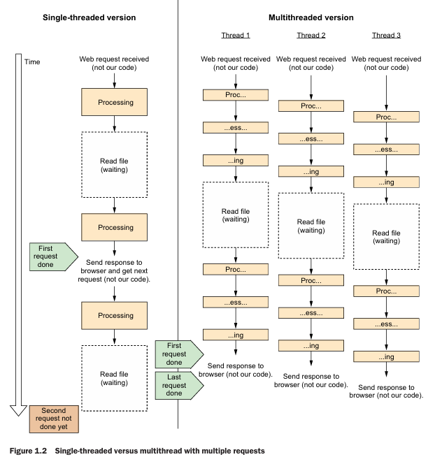
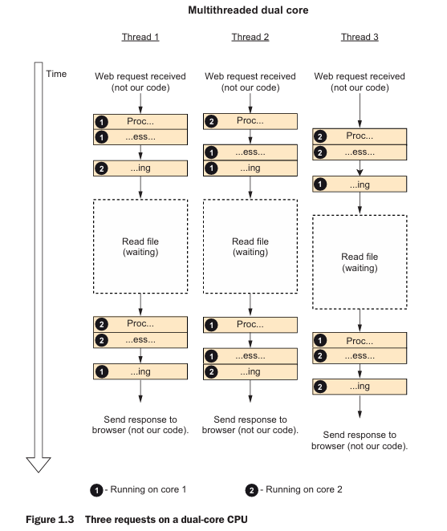
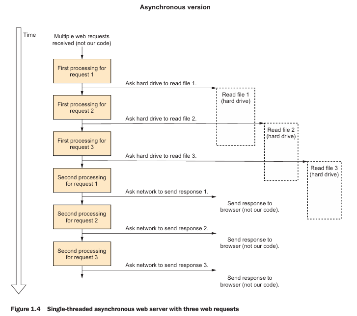
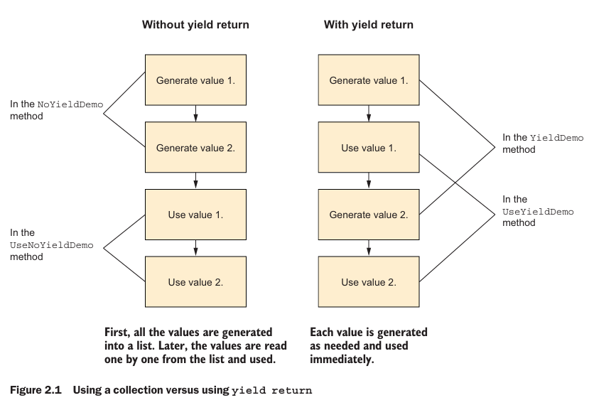
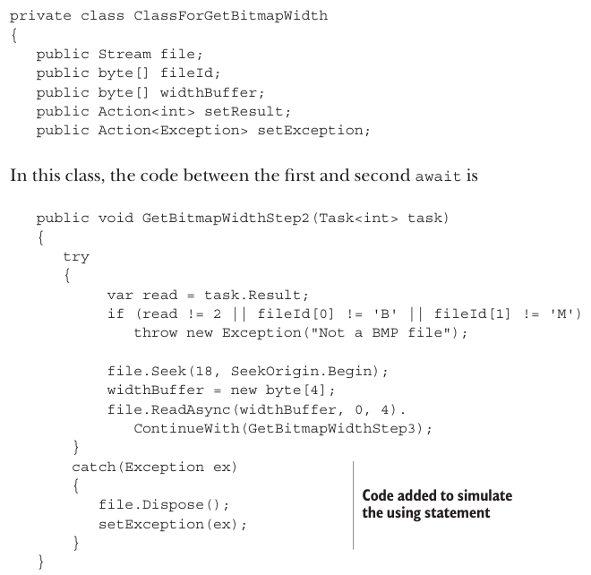
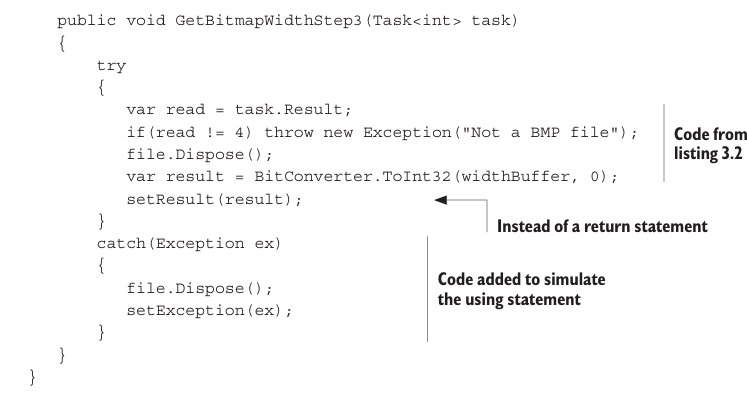
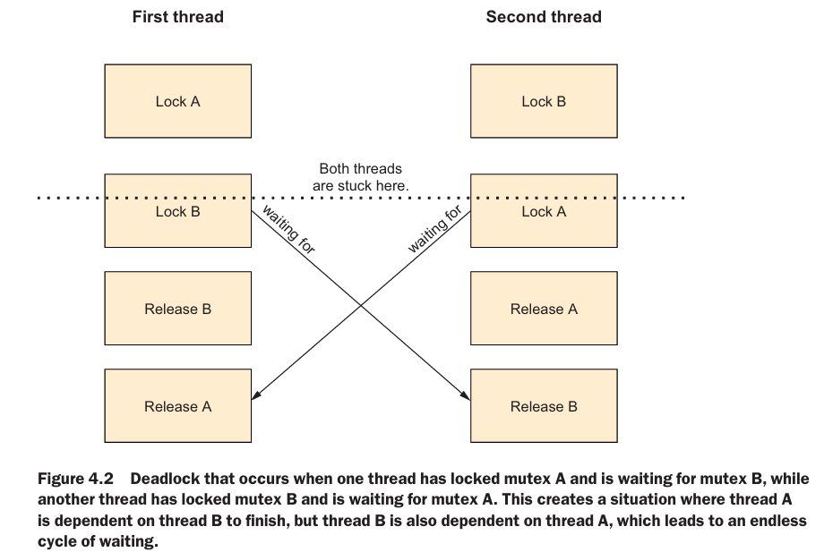

# 🚀 Concurrency in C#

> **Doing more than one thing at a time.**  
> 💡 You need concurrency any time you need an application to do one thing while it’s working on something else.

---

## 🔀 Types of Concurrency

### 👑 Multithreading
Refers to literally using multiple threads.

### 🎇 Parallel Processing
> Doing lots of work by dividing it up among multiple threads that run concurrently.

### 🧠 Asynchronous Programming
It is centered around the idea of an asynchronous operation: some operation that is started that will complete some time later. While the operation is in progress, it doesn’t block the original thread; the thread that starts the operation is free to do other work.

> ✅ When the operation completes, its future or invokes its callback or event to let the application know the operation is finished.

---

## ⚡ Asynchronous Programming

### 💎 Benefits : 
- **🖱Responsiveness** : An asynchronous program can remain responsive to userinput while it’s working.
- **📈Scalability** : A server application can scale somewhat just by using the thread pool, but an asynchronous server application can usually scale an order of magnitude better than that.

> **Asynchronous programming** frees up a thread. For server applications, asynchronous programming frees up request threads; this permits the server to use its threads to serve more requests.

### 🔑 Key Concepts

Modern asynchronous .NET applications use two keywords: 
`async`and `await`. The `async` keyword is added to a method declaration, and performs
a double purpose: it enables the `await` keyword within that method and it signals the compiler to generate a state machine for that method, similar to how `yield return` works. An `async` method may return `Task<TResult>`if it returns a value, `Task` if it doesn’t return a value, or any other “task like” type, such as `ValueTask`.

---

## 🔄 Multithreading vs Single Threading



In **multithreading**, we use multiple threads to do more work — just like multiple cooks making pizzas 🍕.

---

## 🧬 How Asynchronous Programming Works

> Whenever the CPU needs to do something that happens outside the CPU itself (for example, reading a file), it sends the job to the component that handles it (the disk controller) and asks this component to notify the CPU when it’s done. The asynchronous (also called nonblocking) version of the file function just queues the operation with the operating system (that will then queue it with the disk controller) and returns immediately, letting the same thread do other stuff instead of waiting (figure 1.4). Later, we can check whether the operation has been completed and access the resulting data.




> When starting the asynchronous operation, to ask the operating system to notify our program by calling a callback function we registered when starting the asynchronous operation. That callback function will need to run on a new thread (actually, a thread pool), because the original calling thread is not waiting and is currently doing something else. That’s why asynchronous programming and multithreading work well together. 

**Switching between threads is called _context switching_**.

---

### Yield return


For `yield return`, the compiler divides your code into chunks and wraps them in a class that runs the correct chunk at the correct time to simulate a function that can be suspended and resumed.

### 📃 Tasks

A Task does multiple things: it represents an ongoing asynchronous operation, lets us schedule code to run when an asynchronous operation ends, and lets us create and compose asynchronous operations.
A Task represents an event that may happen in the future, while Task<T> represents a value that may be available in the future. A `Task` just lets you know when that background operation finishes running (the Task object represents the event of the background operation ending), and `Task<T>` adds the ability to get the result of the background operation (`Task<T>` represents the value produced by the background operation). A `Task` is not a thread or a background operation, but it is sometimes used to convey the results of a background operation. 

> When we call `Task.Delay(1000)`, we get an object that represents an event that will happen in 1 second but has no corresponding thread or activity. In the same way, if we call `File.ReadAllBytesAsync`, and, for example, there is no thread reading in the background, the system asks the disk controller (a different hardware device than he CPU) to load data and calls us when it’s done, so we get back a `Task<byte[]>` object that represents the data that will be received from the disk in the future.

So a Task or Task<T> object represents an event or a value that may be available in the future. When we want to know whether this event happened or the value is available yet, there are two asynchronous approaches supported by `Task` and `Task<T>` to use a travel metaphor, there are the “_Are we there yet_” model and the “_Wake me up when we arrive_” model. 

### ⏳ Are we there yet 

The *“Are we there yet”* model, you are responsible for asking the `Task` whether it has completed yet, usually in a loop that does other things between those checks (this is called polling), which is done by reading the `IsCompleted` property. Note that `IsCompleted` is true even if the task has errored out or was canceled. 

```c#
var readCompleted = File.ReadAllBytesAsync("example.bin");
while(!readCompleted.IsCompleted)
{
UpdateCounter();
}
var bytes = readCompleted.Result;
// do something with bytes
```

> Most of the time, we don’t have anything useful to do while waiting for IsCompleted to become true, so this model is rarely used.

### Wake me up when we get there

In the “Wake me up when we get there” model, you pass a callback method to the task, and it will call you when it’s complete (or errored out or canceled). This is done by passing the callback to the ContinueWith method. The task is passed as a parameter to the callback, so you can use it to check whether the operation completed successfully and, in the case of `Task<T>`, read the result value : 
```c#
var readCompleted = File.ReadAllBytesAsync("example.bin");
readCompleted.ContinueWith( t =>
{
    if(t.IsCompletedSuccessfully)
    {
        byte[] bytes = t.Result;
        // do something with bytes
    }
});
```

Still this isnt very reliable.

### Tasks 

After the task is completed, both `Task` and `Task<T>` have the `IsFaulted`, `IsCanceled`, `IsCompleted`

> To summarize, when using tasks without async/await, you can use the IsCompleted or Status properties to ask “Are we there yet?” And just like in a car, you don’t want to ask too often. You can use ContinueWith to make the task call you when it completes (“Wake me up when we arrive”). Finally, you can call Wait or Result to make the task synchronous, but that’s inefficient and dangerous because it will block the thread until the task is complete (calling Wait or Result after the task has completed is perfectly efficient and safe because the result is already available, and there’s no need for blocking).

## 💎 How does async and await work?

1. First, we mark our method with the `async` keyword
2. We can no longer return an `value` because as an asynchronous method, our method will return immediately and complete its work later. It’s not possible to return an `value` because we don’t know the correct value at the time the method returns! So for that we use —`Task<int>`. 
3. Insert the `await` keyword before the async method call call. The `await` keyword tells the compiler that the code needs to be suspended at this point and resumed when whatever async operation you are waiting for completes.



Just like with `yield return`, the compiler divides the function into chunks and added code to call them at the correct time.

> **⚠** You should not use `async void`

> 🎯 An async method often returns a result immediately without doing anything asynchronous, you can improve the efficiency by returning `ValueTask` or `ValueTask<T>` instead of `Task` or `Task<T>`. **This is perfect for checking the cache and returning the value immediately.** ValueTask and ValueTask<T> are slightly less efficient than Task and Task<T> if there is an asynchronous operation, but much more efficient if the result was available immediately. It is recommended to return a ValueTask in methods that usually return a value without performing an asynchronous operation, especially if those methods are called often.

## ♦ Multithreading

You create a thread from the `System.Threading.Thread`.  To create a new thread, you first create a new `Thread` object, passing a callback with the code you want to run in the new thread to the constructor. You call `Thread.Start` to start the thread. The Thread.Join() wait so all the threads all finish.
```c#
   var threads = new Thread[3];
   for(int i=0;i<3;++i)   {
      threads[i] = new Thread(DoWork);
      threads[i].Start();
   }

   foreach(var current in threads)  
   {
      current.Join();
   }
   Console.WriteLine("Finished");
```

> 💡 It is not reccomended to use Thread.Start for :
* Asynchronous code
* Short tasks

## 🌊 Thread pool
 
Thread pool manages the thread creation and destruction. With the thread pool, the system keeps a small number of threads waiting in the background, and whenever you have something to run, you can use one of those pre-existing threads to run it. The thread pool is optimized for short-running tasks

> The thread pool is optimized to run many short-running tasks, and we know that asynchronous tasks are actually a sequence of short tasks, so the thread pool is ideal for running asynchronous code.

The `Task.Run` method runs code on the thread pool
```c#
var tasks = new Task[10];
for(int i=0;i<10;++i) 
{
    tasks[i] = Task.Run(RunInPool);  
}
await Task.WhenAll(tasks);  
Console.WriteLine("All finished");
```

The `Task.WhenAll` is similar to Thread.Join, but it doesn't require a loop and waits asynchronously. If you await Task.Run, you are telling your compiler to wait for the task to complete before moving to the next line of code, essentially making it run sequentially, which defeats the purpose of using Task.Run. 

> ⚠ Lambda function captures the variables by reference so for example if you pass an variable i in a for loop that changes you may get unpredictable results. So you should use :
```c#
for(int i=0;i<10;++i)
{
    var icopy = i;
    Task.Run(()=>
    {
        Console.WriteLine($"Hello from thread {icopy}");
    });
}
```

Use Task.Run for :
- Code that uses async-await
- Short running tasks
Do not use Task.Run for : 
- Non asynchronous long running tasks

### 🔒 Locking

> Whenever a thread needs to access the shared state(variable), it “locks” it, and when it is finished with the data, it “releases” the lock. If another thread tries to lock the data while it is already locked, it must wait until the data is released by the current user.This is called a _mutex_ (short for mutual exclusion). In C#, we have the Mutex class that represents the operating system’s mutex implementation and the lock statement that uses an internal .NET implementation. The lock statement is easier to use and faster (because it doesn’t require a system call), so we will prefer to use it. 

```c#
int theValue = 0;
object theLock = new Object();
var threads = new Thread[2];
for(int i=0;i<2;++i)
{
    threads[i] = new Thread(()=>
    {
        for(int j=0;j<5000000;++j)
        {
            lock(theLock)  
            {  
                ++theValue;  
            } 
        }
    });

    threads[i].Start();
}
foreach(var current in threads) 
{ 
    current.Join();
}
Console.WriteLine(theValue);
```

> 💡 It is best practice is to utilize an internal object that is used just for the lock and is accessible only to the code that needs it and because we’re not going to use this object for anything else.

### 🔓 Deadlocks

A deadlock is the situation where a thread or multiple threads are stuck waiting for something that will never happen. The simplest example is where one thread locked mutex A and is waiting for mutex B, while a second thread locked mutex B and is waiting for mutex A.


### Background threads

The `Thread.IsBackground = true` makes the thread so it terminates when the `Main` threads exists.
An application exits when all the non-background threads exit.
---

### Lock and async/await

You are not allowed  to use await inside the code block of the lock statement.
There are 2 reasons : 
* The conceptual problem is that calling await frees up the thread and potentially runs other code, so we don’t even know what code will run. This is a problem because, running code you don’t control while holding a lock can cause deadlocks.
* The practical problem is that the code after the await can run on a different thread, and the system used internally by the lock statement only works if you release the lock from the same thread that locked it.

The best solution is to rearrange your code and move the await outside of the lock block

### When to use async/await ?

- If your code needs to manage a large number of connections simultaneously, use async/await whenever you can.
- If you are using an async-only API, use async/await whenever you use that API
-  If you are writing a native UI application, and you have a problem with the UI freezing, use async/await in the specific long-running code that makes the UI freeze.
- If your code creates a thread per request/item, and a significant part of the run time is I/O (for example, network or file access), consider using async/await.
- If you add code to a codebase that already uses async/await extensively, use 
async/await where it makes sense to you.
- If you add code to a codebase that does not use async/await, avoid async/await in the code as much as possible. If you decide to use async/await in the new code, consider refactoring at least the code that calls the new code to also use async/await.
- If you write code that only does one thing simultaneously, don’t use async/await